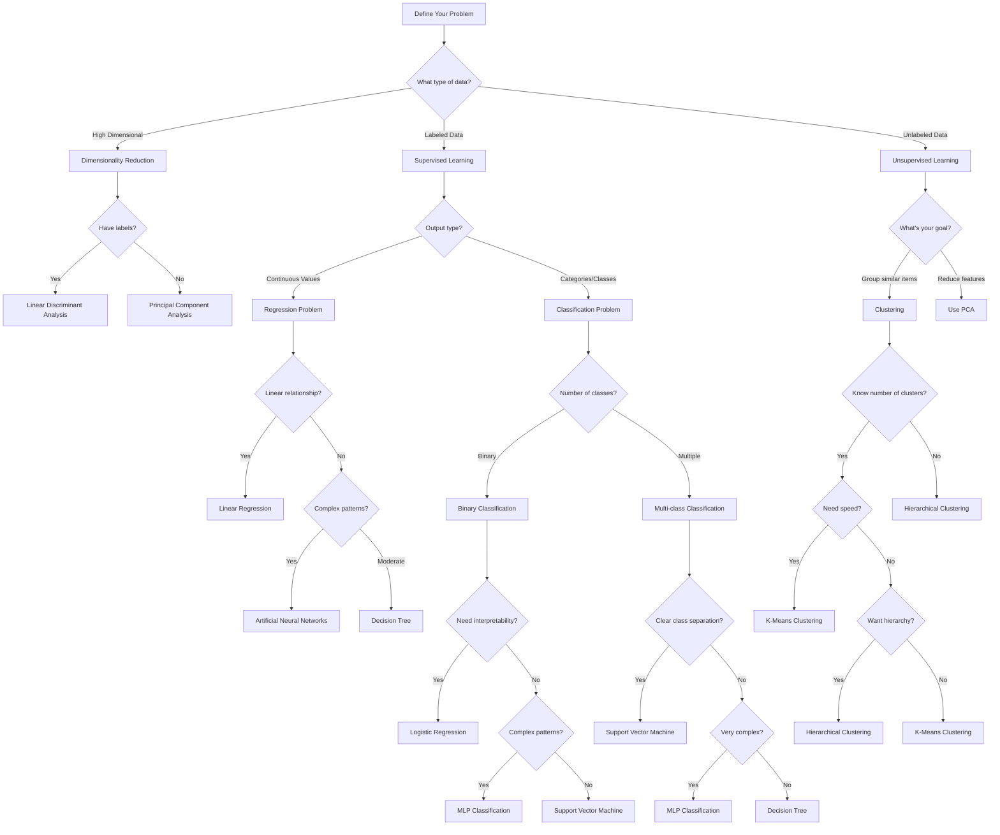
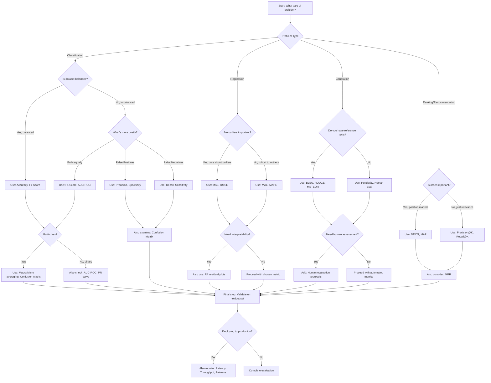

# This repository is examples of work related to Machine Learning

This repo is a work in progress, and is trying to clean up and put together some code examples mostly from the work I completed with the Indian Institute of Technology Roorkee's Executive Education Division in Data Science and Machine Learning, and various projects since then incorperating more real world problems and more advanced coding infrastructure.

The link with the data for the credit card fraud detection is here: https://drive.google.com/file/d/1yDluWXKfBtQvDm3aJ_1ML701EXoBCu77/view?usp=sharing
To be able to run the notebooks where it is a dependency. Access the link, download the csv and put it in the working directory of this repo. The gitignore is programmed to not commit this csv due to it's size.

### Notebooks: 
* classical_machine_learning_concatenated_examples: Concatenated examples of:
    * Principle component analysis
    * Linear Disscriminant Analysis
    * Linear Regression
    * Logistic Regression
    * Support Vector Machine
    * Decision Tree
    * K-Means Clustering
    * Hierarchical Clustering
    * Artificial Nueral Networks
    * MLP Classicication

* Capstone notebooks: a collection of different versions of the group project Kaggle competition looking to classify instances of credit card fraud. This notebook uses the data from the csv that is needed to be downloaded and added to the directory to run this notebook. I do not remember which is the final version of the project and I am working on getting all the notebooks related to this together. The notebooks include multiple ML models trained and assesed for the fraud detection as well as initial data analysis and exploration. 

### Project requirements:
* I've started a requirements.txt file, but I have not yet completed it or checked it by making a new conda environment to check for completion.

### Choosing an ML model guidemap:

### How to evaluate a model guide map:
